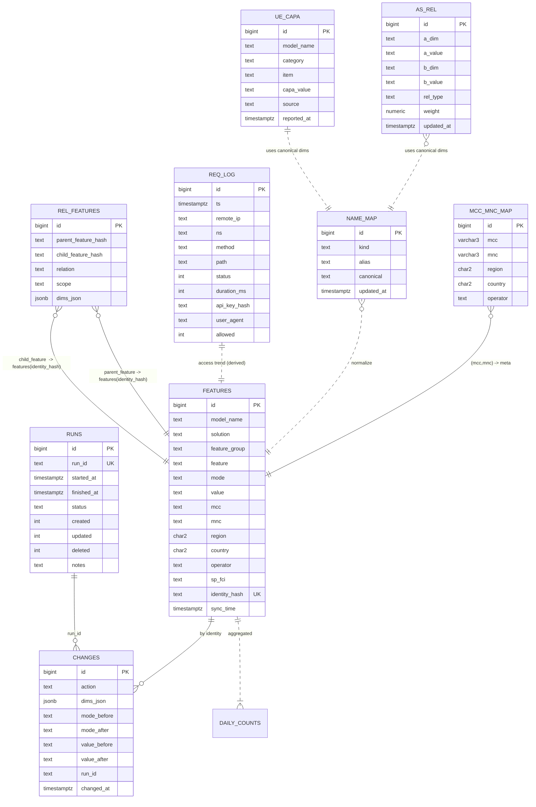

# 🗄️ FMW DB Overview · Schema · DRF/API (2025‑11‑03)

**기준 문서:** 최신 _FMW Project/Architecture Overview_ 반영  
**Phase‑1:** SQLite(Windows) → **Phase‑2:** PostgreSQL  
**보안:** NGINX **IP Allowlist**(1차) + DRF **권한/Throttle**(2차), **ReqLog** 전면 감사

> 본 문서는 **DB 모델/스키마/DRF/API**를 한 번에 최신화합니다. 아래 **v1 리소스**는 Cohort도 접근, **dev 리소스**는 운영 3인(IP+`X‑API‑Key`) 전용입니다.

---

## 0) 모델 카탈로그 (요구 반영)

### v1 (Read‑Only)

- **Features** — 정책/피처 스냅샷(SSOT)
- **AllowList** — 허용 규칙 뷰(Features에서 `mode='allow'` 파생)
- **BlockList** — 차단 규칙 뷰(Features에서 `mode='block'` 파생)
- **RelFeatures** — 피처 간 관계(의존/충돌/상호배타 등)
- **AsRel** — 도메인 간 연관 규칙(모델↔사업자 등 사상 규칙)
- **UeCapa** — 단말(UE) 기능/규격 스냅샷

### dev (Ops 전용)

- **SlsiAllowList / MtkAllowList** — 벤더 소스 허용 리스트(스테이징)
- **SlsiBlockList / MtkBlockList** — 벤더 소스 차단 리스트(스테이징)
- **UeCapaRecord** — UE Capability 원천 레코드(정규화 전)
- **NameMap** — 별칭→표준 매핑 테이블
- **MccMncMap** — MCC/MNC→지역/국가/사업자 보강
- **AccessLog** — 접근 감사(`req_log`)
- **SyncHistory** — 동기화 실행 이력(`runs`)
- **Changes** — C/U/D 변경 히스토리

---

## 1) 논리 ERD (Mermaid)



> **AllowList/BlockList**는 물리 테이블이 아니라 **DB View**(또는 DRF 필터)로 노출 권장.

---

## 2) 물리 스키마 (Phase‑1/2 공통 지침)

- **키/멱등**: `identity_hash = sha256(normalized_keyset)`(모델/솔루션/그룹/피처/모드/값/지역/국가/사업자 등)
- **시간대**: 저장 UTC(Phase‑2 `timestamptz`), 표시 KST
- **검증**: `solution ∈ {slsi, mtk}`, `mode ∈ {allow, block, none}`, `mcc=3자리`, `mnc=2~3자리`, `country=ISO‑alpha2`
- **성능**: 최근 90일 partial index, `lower(model_name)` expr index, JSONB GIN(`dims_json`)@PG

### 2.1 핵심 테이블 (PG DDL 예시)

```sql
CREATE TABLE features (
  id BIGSERIAL PRIMARY KEY,
  model_name TEXT NOT NULL,
  solution TEXT NOT NULL CHECK (solution IN ('slsi','mtk')),
  feature_group TEXT NOT NULL,
  feature TEXT NOT NULL,
  mode TEXT NOT NULL CHECK (mode IN ('allow','block','none')),
  value TEXT,
  mcc TEXT, mnc TEXT, region CHAR(2), country CHAR(2), operator TEXT, sp_fci TEXT,
  identity_hash TEXT UNIQUE NOT NULL,
  sync_time TIMESTAMPTZ NOT NULL
);
CREATE INDEX idx_features_sync_recent ON features(sync_time DESC)
  WHERE sync_time >= now() - interval '90 days';
CREATE INDEX idx_features_model_lower ON features(lower(model_name));

CREATE TABLE rel_features (
  id BIGSERIAL PRIMARY KEY,
  parent_feature_hash TEXT NOT NULL,
  child_feature_hash  TEXT NOT NULL,
  relation TEXT NOT NULL CHECK (relation IN ('depends_on','conflicts_with','implies')),
  scope TEXT,
  dims_json JSONB
);
CREATE INDEX idx_rel_parent ON rel_features(parent_feature_hash);
CREATE INDEX idx_rel_child  ON rel_features(child_feature_hash);

CREATE TABLE as_rel (
  id BIGSERIAL PRIMARY KEY,
  a_dim TEXT NOT NULL, a_value TEXT NOT NULL,
  b_dim TEXT NOT NULL, b_value TEXT NOT NULL,
  rel_type TEXT NOT NULL CHECK (rel_type IN ('maps_to','excludes','aliases')),
  weight NUMERIC,
  updated_at TIMESTAMPTZ DEFAULT now()
);
CREATE UNIQUE INDEX ux_as_rel ON as_rel(a_dim,a_value,b_dim,b_value,rel_type);

CREATE TABLE ue_capa (
  id BIGSERIAL PRIMARY KEY,
  model_name TEXT NOT NULL,
  category TEXT NOT NULL,  -- e.g., 'IMS','RAT','Band'
  item TEXT NOT NULL,      -- e.g., 'VoLTE','NR','n78'
  capa_value TEXT,
  source TEXT,
  reported_at TIMESTAMPTZ
);

CREATE TABLE changes (
  id BIGSERIAL PRIMARY KEY,
  action TEXT NOT NULL CHECK (action IN ('created','updated','deleted')),
  dims_json JSONB,
  mode_before TEXT, mode_after TEXT,
  value_before TEXT, value_after TEXT,
  run_id TEXT,
  changed_at TIMESTAMPTZ NOT NULL
);
CREATE INDEX idx_changes_changed_at ON changes (changed_at DESC);

CREATE TABLE runs (
  id BIGSERIAL PRIMARY KEY,
  run_id TEXT UNIQUE NOT NULL,
  started_at TIMESTAMPTZ, finished_at TIMESTAMPTZ, status TEXT,
  created INT, updated INT, deleted INT, notes TEXT
);

CREATE TABLE name_map (
  id BIGSERIAL PRIMARY KEY,
  kind TEXT NOT NULL,
  alias TEXT NOT NULL,
  canonical TEXT NOT NULL,
  updated_at TIMESTAMPTZ DEFAULT now(),
  UNIQUE(kind, alias)
);

CREATE TABLE mcc_mnc_map (
  id BIGSERIAL PRIMARY KEY,
  mcc VARCHAR(3) NOT NULL,
  mnc VARCHAR(3) NOT NULL,
  region CHAR(2), country CHAR(2), operator TEXT,
  UNIQUE(mcc, mnc)
);

CREATE TABLE req_log (
  id BIGSERIAL PRIMARY KEY,
  ts TIMESTAMPTZ NOT NULL,
  remote_ip TEXT NOT NULL,
  ns TEXT NOT NULL,         -- v1/dev/ops/admin/streamlit
  method TEXT NOT NULL,
  path TEXT NOT NULL,
  status INT NOT NULL,
  duration_ms INT NOT NULL,
  api_key_hash TEXT,
  user_agent TEXT,
  allowed INT DEFAULT 1
);
CREATE INDEX idx_reqlog_ts ON req_log (ts DESC);
CREATE INDEX idx_reqlog_ns_ts ON req_log (ns, ts DESC);
CREATE INDEX idx_reqlog_ip_ts ON req_log (remote_ip, ts DESC);
```

### 2.2 파생 뷰 (권장)

```sql
CREATE VIEW v1_allow_list AS
  SELECT * FROM features WHERE mode='allow';
CREATE VIEW v1_block_list AS
  SELECT * FROM features WHERE mode='block';
```

### 2.3 스테이징(벤더/원천)

```sql
CREATE TABLE slsi_allow_list   (like features including all);
CREATE TABLE slsi_block_list   (like features including all);
CREATE TABLE mtk_allow_list    (like features including all);
CREATE TABLE mtk_block_list    (like features including all);
CREATE TABLE ue_capa_record (
  id BIGSERIAL PRIMARY KEY,
  model_name TEXT, raw_payload JSONB, source TEXT, received_at TIMESTAMPTZ DEFAULT now()
);
```

---

## 3) DRF / API 설계 (최신)

### 3.1 네임스페이스 & 권한

- **v1**: Cohort 포함, **IP Allowlist**(Nginx) + `IsIPAllowedV1`
- **dev**: 운영 3인 전용, **IP Allowlist** + `IsIPAllowedDevWithKey`(**IP + `X‑API‑Key`**)
- (권장) Throttle: v1=`100/min`, dev=`20/min`

### 3.2 v1 엔드포인트

- `GET /api/v1/features` — 필터: `model_name, solution, feature_group, feature, mode, value, mcc, mnc, region, country, operator, sp_fci`
- `GET /api/v1/allow-list` — (= `v1_allow_list` 뷰 또는 `mode=allow`)
- `GET /api/v1/block-list` — (= `v1_block_list` 뷰 또는 `mode=block`)
- `GET /api/v1/rel-features` — 필터: `parent_feature_hash, child_feature_hash, relation`
- `GET /api/v1/as-rel` — 필터: `a_dim,a_value,b_dim,b_value,rel_type`
- `GET /api/v1/ue-capa` — 필터: `model_name, category, item`
- `GET /api/v1/features/download` — CSV 내보내기

### 3.3 dev 엔드포인트 (Ops)

- `GET /api/dev/slsi/allow-list` · `GET /api/dev/mtk/allow-list`
- `GET /api/dev/slsi/block-list` · `GET /api/dev/mtk/block-list`
- `GET /api/dev/ue-capa-record`
- `GET /api/dev/name-map` · `POST /api/dev/name-map`(옵션: 관리)
- `GET /api/dev/mcc-mnc-map`
- `GET /api/dev/access-log` — (= `req_log`) 필터: `from,to,ns,ip,path,status`
- `GET /api/dev/sync-history` — (= `runs`)
- `GET /api/dev/changes` — 필터: `run_id, action, from, to`
- (옵션) `POST /api/dev/sync/run` — 수동 동기화 트리거

> dev 쓰기(POST)는 내부 승인 시에만 활성화.

### 3.4 직렬화(발췌)

```python
class FeatureSerializer(ModelSerializer):
    class Meta: model=Feature; fields='__all__'
class RelFeatureSerializer(ModelSerializer):
    class Meta: model=RelFeature; fields='__all__'
class AsRelSerializer(ModelSerializer):
    class Meta: model=AsRel; fields='__all__'
class UeCapaSerializer(ModelSerializer):
    class Meta: model=UeCapa; fields='__all__'

class NameMapSerializer(ModelSerializer):
    class Meta: model=NameMap; fields='__all__'
class MccMncMapSerializer(ModelSerializer):
    class Meta: model=MccMncMap; fields='__all__'
class AccessLogSerializer(ModelSerializer):
    class Meta: model=ReqLog; fields=['ts','remote_ip','ns','method','path','status','duration_ms']
class RunSerializer(ModelSerializer):
    class Meta: model=Run; fields='__all__'
class ChangeSerializer(ModelSerializer):
    class Meta: model=Change; fields='__all__'
```

### 3.5 라우팅(발췌)

```python
# v1
router.register(r'v1/features', FeatureViewSet)
router.register(r'v1/allow-list', AllowListViewSet)
router.register(r'v1/block-list', BlockListViewSet)
router.register(r'v1/rel-features', RelFeatureViewSet)
router.register(r'v1/as-rel', AsRelViewSet)
router.register(r'v1/ue-capa', UeCapaViewSet)
# dev
router.register(r'dev/slsi/allow-list', SlsiAllowListViewSet)
router.register(r'dev/mtk/allow-list',  MtkAllowListViewSet)
router.register(r'dev/slsi/block-list', SlsiBlockListViewSet)
router.register(r'dev/mtk/block-list',  MtkBlockListViewSet)
router.register(r'dev/ue-capa-record',  UeCapaRecordViewSet)
router.register(r'dev/name-map',        NameMapViewSet)
router.register(r'dev/mcc-mnc-map',     MccMncMapViewSet)
router.register(r'dev/access-log',      AccessLogViewSet)
router.register(r'dev/sync-history',    RunViewSet, basename='runs')
router.register(r'dev/changes',         ChangeViewSet)
```

### 3.6 응답 예시

```json
GET /api/v1/allow-list?model_name=A50&feature=VoLTE
[
  {
    "model_name":"A50","solution":"slsi","feature_group":"IMS","feature":"VoLTE",
    "mode":"allow","value":"on","mcc":"450","mnc":"05","country":"KR",
    "operator":"SKT","identity_hash":"...","sync_time":"2025-11-03T00:00:00Z"
  }
]
```

---

## 4) 마이그레이션/전환

- Phase‑1 최소 FK → Phase‑2에 `changes.run_id→runs`, `features(mcc,mnc)→mcc_mnc_map` 선택 FK 도입
- 사전 적재(READ‑ONLY 검증) → 증분 이관 → 커넥션 스위치 → 카운트·해시·KPI 대조 → 롤백 스냅샷

---

## 5) 검증/운영 DoD

- [ ] v1 모든 엔드포인트 **P95<5s**, CSV Export 정합
- [ ] dev 엔드포인트 **IP+Key**·Throttle 통과자만 접근
- [ ] `req_log` 누락 없음(기간/NS/IP/Status 필터)
- [ ] DB 제약/인덱스 실행 계획 점검(최근 90일 partial/expr/GIN/BRIN)

---

## 부록 A) 품질 SQL (PG)

```sql
-- 도메인 검증
SELECT COUNT(*) FROM features WHERE solution NOT IN ('slsi','mtk');
SELECT COUNT(*) FROM features WHERE mode NOT IN ('allow','block','none');
SELECT COUNT(*) FROM features WHERE mcc IS NOT NULL AND mcc !~ '^\d{3}$';
SELECT COUNT(*) FROM features WHERE country IS NOT NULL AND country !~ '^[A-Z]{2}$';
-- 해시 유일성
SELECT identity_hash, COUNT(*) FROM features GROUP BY 1 HAVING COUNT(*)>1;
```

## 부록 B) 뷰 구현 대안

- 성능이 충분하면 **뷰 없이 DRF 필터**만으로 `allow-list/block-list` 제공 가능
- 빈번히 사용되는 경우 DB View 또는 **물리화(Materialized View)** + 배치 리프레시 권장

완료! **“FMW_DB_Overview_Schema_DRF_API_20251103.md”** 문서를 캔버스에 새로 작성했습니다.  
요청하신 **v1/ dev 모델 구성(Features, Allow/Block, RelFeatures, AsRel, UeCapa… 등)**을 반영했고, ERD·PG DDL·파생뷰·DRF 엔드포인트·시리얼라이저·라우팅·검증 SQL·DoD까지 한 번에 정리했습니다.

필요하시면:

- 이 문서를 **PDF/ZIP**으로 내보내기,
- **OpenAPI YAML** 전체본 생성,
- **마이그레이션 스크립트**(SQLite→PostgreSQL) 자동 생성

바로 만들어 드릴게요.