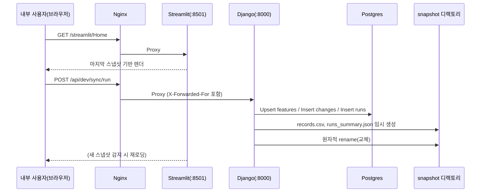

# (1) 시스템 컨텍스트 — Obsidian·Mermaid (수정본)

아래 **두 가지 버전** 다이어그램은 동일한 구조를 표현합니다.  
- **버전 A**: 단순/호환성 높음(권장)  
- **버전 B**: 포트/헤더/경계까지 표기(상세)  
- 보너스: **시퀀스 다이어그램**으로 요청 흐름을 재확인

---

## 버전 A — 단순 컨텍스트 맵 (권장)
```mermaid
flowchart LR
  U[내부 사용자\n(Dev/운영/기획)] -->|브라우저| NX[Nginx 게이트웨이\n(IP Allowlist)]
  subgraph HOST[Host (루프백 바인딩)]
    NX -->|/streamlit/* 프록시| ST[Streamlit Viewer\n127.0.0.1:8501]
    NX -->|/api/* 프록시| DJ[Django API/ETL\n127.0.0.1:8000]
    ST -->|스냅샷 로드| FS[(snapshot/\nrecords.csv\nruns_summary.json)]
    DJ -->|읽기·쓰기| DB[(Postgres\nfeatures / changes\nruns / daily_counts\nname_map / mcc_mnc_map)]
  end
  EXT[외부 원천(정책/피처 등)] --> SY[Sync 스크립트/잡]
  SY --> DJ
```

**설명**
- **Nginx**는 사내 IP만 허용(Allowlist)하고, 요청을 **Streamlit** 또는 **Django**로 **프록시**합니다.
- **Streamlit**은 **DB를 직접 조회하지 않고** 스냅샷 파일을 읽어 렌더링합니다.
- **Django**는 **DB에 읽기/쓰기**를 수행하고, ETL/스냅샷 생성도 담당합니다.
- **Sync 스크립트**는 외부 원천 데이터를 수집해 Django(ETL)를 호출합니다.

---

## 버전 B — 포트·헤더·경계 표기 (상세)
```mermaid
flowchart LR
  subgraph NET[사내 네트워크 경계]
    U[내부 사용자\n브라우저] -->|HTTP(S)| NX[Nginx 게이트웨이\n(IP Allowlist)]
  end

  subgraph HOST[Host (루프백 127.0.0.1)]
    ST[Streamlit\n:8501\n(루프백 바인딩)]
    DJ[Django API/ETL\n:8000\n(루프백 바인딩)]
    FS[(snapshot/\nrecords.csv\nruns_summary.json)]
    DB[(Postgres\nfeatures/changes/runs/\ndaily_counts/name_map/mcc_mnc_map)]
    NX -->|/streamlit/*| ST
    NX -->|/api/*\nX-Forwarded-For 전달| DJ
    ST -->|읽기| FS
    DJ <--> |읽기·쓰기| DB
  end

  EXT[외부 원천(정책/피처 등)] --> SY[Sync 스크립트/잡]
  SY -->|ETL 트리거| DJ
```

**설명**
- **루프백 바인딩**: Streamlit/Django는 `127.0.0.1`에서만 수신 → 직접 외부 접근 차단.
- **X-Forwarded-For**: 원본 클라이언트 IP를 Django로 전달(로그/감사/제어에 활용).
- **스냅샷 파일**: `records.csv`, `runs_summary.json`은 **임시 파일 생성 → 원자적 rename**으로 교체.

---

## 보너스 — 요청 흐름(시퀀스 다이어그램)


---

### 체크 포인트
- Obsidian의 **Mermaid**가 활성화되어 있어야 합니다(기본값: 활성).
- 문제가 지속되면, 먼저 **버전 A** 다이어그램만 사용해 렌더링 확인 후 **버전 B**로 확장하세요.