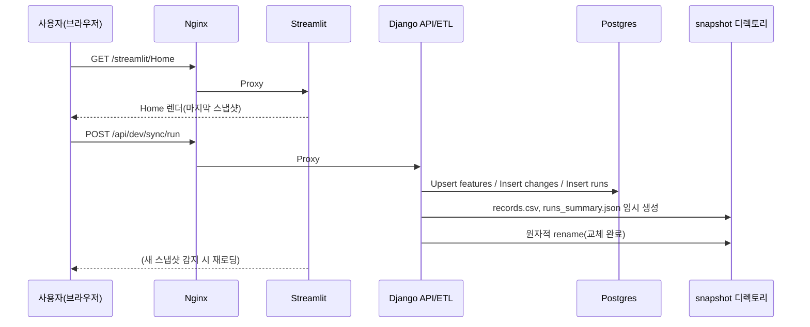
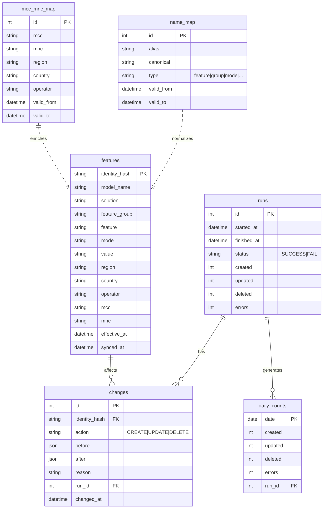
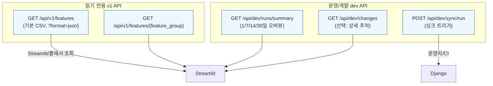

# FMW 전체 시스템 구조 (Obsidian·Mermaid) — 2025-10-31

> 이 노트는 **Obsidian**에서 바로 렌더링되도록 **Mermaid** 다이어그램으로 구성되었습니다.  
> 그대로 붙여넣거나 파일로 저장해 Vault에 넣으세요.

---

## 1) 시스템 컨텍스트 (사용자↔게이트웨이↔서비스↔데이터)
```mermaid
flowchart LR
    user[내부 사용자\n(Dev/운영/기획)] -->|브라우저| NX[Nginx 게이트웨이\n(IP Allowlist)]
    subgraph HOST[내부 서버(루프백 바인딩)]
      NX -->|/streamlit/* 프록시| ST[Streamlit Viewer\n127.0.0.1:8501]
      NX -->|/api/* 프록시| DJ[Django API/ETL\n127.0.0.1:8000]
      ST -->|스냅샷 로드| FS[(snapshot/\nrecords.csv\nruns_summary.json)]
      DJ -->|읽기·쓰기| DB[(Postgres\nfeatures / changes\nruns / daily_counts\nname_map / mcc_mnc_map)]
    end
    EXT[외부 원천(정책/피처 등)] --> SY[Sync 스크립트/잡]
    SY --> DJ
    classDef comp fill:#f8f8f8,stroke:#666,stroke-width:1px,color:#222;
    class NX,ST,DJ,DB,FS,HOST,SY comp;
```

---

## 2) 데이터 파이프라인(ETL) — 스냅샷 우선
```mermaid
flowchart LR
    A[Extract\n(Sync)] --> B[Normalize\n(name_map 적용)]
    B --> C[MCC/MNC 매핑\n(mcc_mnc_map 보강)]
    C --> D[Upsert → features\n(identity_hash UNIQUE)]
    D --> E[Write changes\n(before/after, run_id)]
    E --> F[Aggregate daily_counts\n(1/7/14/30)]
    F --> G[Write snapshots\nrecords.csv & runs_summary.json\n(임시 생성 → 원자적 교체)]
```

---

## 3) 동작 시나리오 (시퀀스) — 싱크 트리거부터 UI 갱신까지


---

## 4) 데이터베이스 ERD (핵심 테이블)


---

## 5) API 개요(참조용)


---

### 사용 팁
- Obsidian에서 **Mermaid** 플러그인이 활성화되어 있어야 합니다(기본 활성).  
- 다이어그램이 길면 *편집 모드*에서 접고 펼치며 검토하세요.  
- 팀 공유용으로 이 파일을 Vault에 그대로 두거나, 필요한 섹션만 복사해 새 노트를 만들어도 됩니다.